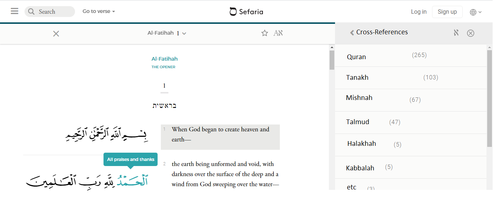

# Qur'an
Cross-reference verses of the  Quran (in Arabic and English) with Jewish source texts (in Hebrew and English)

## TODO

### Data
- ✅ Get Quran arabic from arabic corpus
- ✅ Get word-by-word translation from arabic corpus
- ✅ scrape together parallel english translations 
- ✅ Get arabic verses of Quran to display
- ✅ get audio of quran in hafs (mishary), warsh (jazari), hamza (sufi)
- ✅ Get tanakh for cross-referencing 

### Backend AI / NLP (python3)
- ✅ store each verse of quran in arabic and parallel english (csv)
- ✅ encode each verse by arabic root letters + arabic bigram root letters + arabic trigram root letters + arabic words + morph features and cross-reference against each other and save cross-reference results for later retrieval
- ✅ encode query into wordnet vectors
- ✅ improve cross-reference results using wordnet vectors 
- ✅ improve cross-reference results using morphological vectors
- ✅ encode each verse by wordnet vectors + save vectors
- ✅ encode sefaria data into same space
- Automatically segment Hebrew Audio so its in verses?
- Automatically segment Arabic Hamza Recitation so its in verses

### Backend Functions (python3)
- ✅ index search quran by chapter
- ✅ index search quran by verse
- ✅ fuzzy search words/strings across quran verses
- ✅ semantic search words/strings across quran verses
- ✅ search verse of quran against quran 
- ✅ display what features the match was based on 
- ✅ display arabic verse
- ✅ search verse of quran against sefaria
- tags to show features and reasons why verses are linked

### Deployment (python3 - flask, heroku)
- ✅ setup a basic flask
- ✅ search by verse, 
- ✅ search by chapter, 
- ✅ display arabic 
- ✅ display english parallel
- ✅ play audio (arabic)
- ✅ play audio (bible)
- ✅ search by string, 
- dropdown for chapter (quran and bible)
- dropdown for verse (quran and bible)
- host backend on heroku
- reduce memory somehow

### Frontend (css/html/js)
- implement mock design frontend
- user can link custom verses of Quran and Bible to a verse